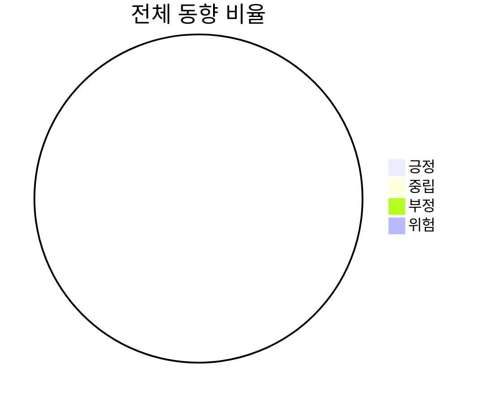

[동향]에서 입력한 내용을 토대로 stub를 통해 분석합니다.

## 1. 동향 요약
콘텐츠 / 이슈 / 동향 / 근거 내용 / 원인 / 언어 / 출처 / 신뢰도를 표로 나타냅니다.
콘텐츠가 동일하면 같은 콘텐츠로, 그 안에서 이슈 명이 동일하면 같은 이슈로 묶어 칸을 합치고 근거를 여러 개 나란히 표시합니다.
한 개의 콘텐츠에 여러 개의 이슈가 있을 수 있고, 한 개의 이슈에 여러 개의 근거가 있을 수 있습니다.
언어, 출처는 각 근거 내용에 따라 값을 가집니다.

'동향'은 근거 내용을 긍정/중립/부정/위험 4가지 중 하나로만 분류합니다. 법적 이슈나 대규모 이탈로 이어질 수 있는 표현은 다른 신호보다 우선해 '위험'으로 분류하며, 분류할 근거 내용이 없으면 중립으로 둡니다.
'신뢰도'는 근거 내용(리뷰 원문)이 있으면 +0.7, 근거 ID·언어·출처가 채워질 때마다 +0.1씩 더해 0~1로 산정합니다. 근거 내용이 없으면 0.3을 넘지 않습니다.
항목을 알 수 없으면 "근거 부족"으로 표시하며, 일부 항목이 비어 있어도 동향·근거 내용·원인은 알 수 있는 만큼 먼저 채우고 신뢰도만 낮춥니다.

| 콘텐츠 | 이슈 | 동향 | 근거 내용 | 원인 | 언어 | 출처 | 신뢰도 |
| --- | --- | --- | --- | --- | --- | --- | --- |
| <콘텐츠> | <이슈> | <긍정\|중립\|부정\|위험> | <근거 내용> | <원인> | <언어> | <출처> | <0~1> |

## 2. 동향 그래프
왼쪽은 전체 동향(긍정/중립/부정/위험)을 퍼센티지로 표현한 원형 그래프이고, 오른쪽은 같은 동향을 언어별로 나눠 막대 그래프로 보여줍니다.
긍정은 Green, 중립은 Yellow, 부정은 Orange, 위험은 Red로 표시합니다.

- <언어 1>: 긍정 0건 · 중립 0건 · 부정 0건 · 위험 0건

## 3. 컨텐츠 별 동향 분석
콘텐츠 → 이슈 → 원인 → 근거 → 개선 순으로 정리합니다.
근거 ID는 바로 노출하지 않고, 근거 옆에 표시해 필요할 때만 확인합니다.
이슈 안에 '위험'으로 분류된 근거가 있으면 그 언어를 별도 대응 경고로 표시합니다.

- <콘텐츠 1>
  - <이슈 1>
    - 원인: <원인 1>, <원인 2>
    - 근거: <근거 1>, <근거 2>
    - 개선: <개선 방향 1>, <개선 방향 2>
    - (위험 근거가 있는 경우) ⚠ <언어>에서 위험 신호가 확인되어 별도 대응이 필요합니다.

## 4. 종합
전체 동향 요약을 먼저 짧게 설명한 뒤, 원인들을 개선 테마로 묶어 우선순위가 높은 방향부터 개선 방향 위주로 서술합니다.
개별 개선 문장을 그대로 나열하지 않습니다. 특정 언어에서 위험 신호가 확인된 경우 마지막에 이어서 설명합니다.

- <전체 동향 요약 한 문장>
- <종합 개선 방향>
- (위험 신호가 있는 경우) <위험 언어권 설명>
